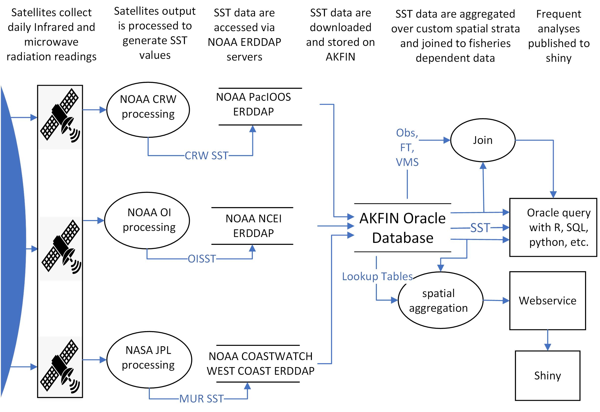
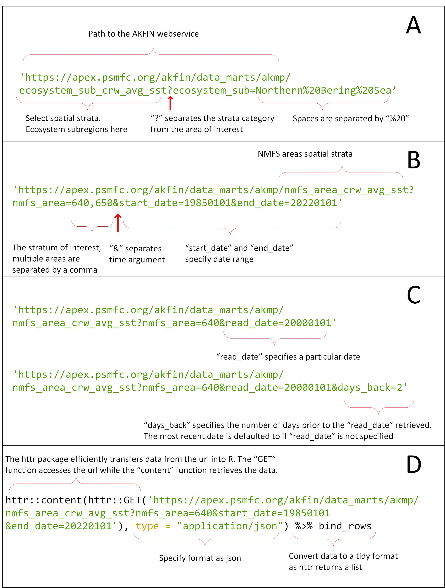

---
output:
  word_document:
    pandoc_args: ["--metadata-file=header.yaml"]
    reference_docx: styles_reference.docx
    df_print: kable
csl: "../cite/citestyle.csl"
bibliography: "../cite/webservice_biblio.bib"
---

```{r setup, include=FALSE}
knitr::opts_chunk$set(warning = FALSE, error = FALSE, message = FALSE, fig.width=6, fig.height=4)
```

```{r,include=F}
library(tidyverse)
library(DBI) #  For database query
library(odbc)
library(sp) # For maps
library(rgdal) # For maps
library(broom)
library(heatwaveR)
library(lubridate)

#  Load the AKFIN database user name and password from an external file.
params <- read_csv("markdown_odbc_params.csv")

#  Connect to the AKFIN database
# con <- dbConnect(odbc::odbc(), "akfin", UID=rstudioapi::askForPassword("Enter AKFIN Username"), PWD= rstudioapi::askForPassword("Enter AFSC Password"))
con <- dbConnect(odbc::odbc(), "akfin", UID=params$uid, PWD=params$pass)
```

</br>

# `Automated and operational access to environmental data for Alaska’s management areas `

`Jordan T Watson and Matthew W Callahan`


</br>


# Abstract

The proliferation of operational satellite data has facilitated downstream data products catered towards specific fisheries applications in near real-time. The Alaska Fisheries Science Center and Alaska Fisheries Information Network (AKFIN) have utilized such data accessibility to streamline use of satellite sea surface temperature (SST) data. We briefly describe three gridded satellite data sets and we present two data products that are updated automatically and regularly in a database backend: 1) satellite SST data linked to spatial management regions across Alaska and 2) spatially-explicit fishery-dependent data (e.g., observer, fish ticket, and vessel monitoring system [VMS] data) linked with satellite SST data. Full gridded data sets apportioned to management areas can be queried from the AKFIN database. Alternatively, aggregated data products (e.g., time series of SST for individual management regions or ecosystem areas) can be accessed via a custom AKFIN SST web service. We demonstrate several queries of the web service and illustrate how this product can yield seamless integration with downstream analyses. For fisheries-dependent sources, SST data were linked to fish tickets, observer, and VMS in the Oracle backend from 2002 - present (millions of records), and new data are automatically matched each day. We provide examples of how these processes facilitate efficient use of SST data, and describe opportunities for expansion of these services.


# Introduction

The role of oceanographic and other environmental or ecosystem parameters on the productivity of the world’s fish stocks has long been established. Increasingly, such parameters are explicitly incorporated into fisheries stock assessments [@Holsman2016; @Marshall2019], risk assessments [@Gaichas2014]; ecosystem reports [@Ferriss2020; @Ortiz2020; @Siddon2020], or other documents used by the U.S. Regional Fishery Management Councils to guide decision making. Meanwhile, a growing trend in the development of dynamic ocean management tools seeks to incorporate environmental information in near real-time to inform stakeholders for bycatch avoidance [@Hazen2018; @Breece2021], harmful algal blooms [@Harley2020], avoiding interactions with protected species (https://oceanview.pfeg.noaa.gov/whale_indices/), and more. Thus, as NOAA moves towards a broader adoption of ecosystem-based fisheries management and dynamic ocean management, the accessibility of ecosystem information becomes increasingly critical.   

As global climate changes, water temperatures have been among the most easily measured metrics by which to understand how ocean ecosystems are responding. Broad warming trends are leading to poleward shifts in the distributions of fish species and the fleets that target them [@Kotwicki2013; @Rogers2019; @Pinsky2020; @Fredston2021], while anomalously warm periods or marine heatwaves are driving protracted impacts on ecosystems [@Suryan2021] and commercial fish stocks [@Barbeaux2020]. Such dynamics underscore the need for reliable access to near real-time water temperature data.    

Satellite-derived sea surface temperature (SST) data are well validated and have been available since the early 1980s [@Minnett2019]. A proliferation of new technologies, sensors, and data products have led to increasingly frequent and spatially resolved SST data with latencies as little as one day [@Liu2015; @Maturi2017; @Minnett2019]. Moreover, the development of programs like NOAA’s CoastWatch and data technologies like Environmental Research Division's data access program (ERDDAP) servers [@Simons2020] have facilitated easier access to these data worldwide in near real-time and via a suite of data formats. While such technologies have improved data access, challenges still exist for some end users due to the large file sizes of high spatial and temporal resolution data sets, difficulty subsetting data within irregular polygons (custom spatial strata), and the need for data infrastructure that supports operationalization and automation of data ingestion [@Welch2019].   

After assessing the needs of a suite of fisheries biology, stock assessment, and socio-ecological modeling efforts at the AFSC, we developed an automated and operational framework for serving satellite environmental data products for a suite of spatial strata used for fisheries management and research in Alaska. These are products initiated by AFSC requests, and developed by AKFIN and AFSC staff in the AKFIN database environment. We describe the data used, the process for joining the data to spatial strata, data access through customized web services (data queries via URL), and backend database merges with fishery dependent data (e.g. observer, fish ticket, VMS data).

# Methods & Results

*Satellite data*   
Three daily satellite SST products were accessed via NOAA ERDDAP servers [@Simons2020] and downloaded as netCDF files within the Oracle database backend at the Alaska Fisheries Information Network (AKFIN), maintained by the Pacific States Marine Fisheries Commission. The SST data are publicly available but by ingesting them into the AKFIN backend, they can be seamlessly merged, behind the NOAA firewall, with confidential fishery-dependent data sets like observer, VMS, fish ticket data. These SST products provide gap-free data each day with a 1-2 day latency period. 

The SST data sets used are from NOAA Coral Reef Watch (CRW), NASA Jet Propulsion Laboratory Multi-Scale Ultra-High Resoultion (MUR), and NOAA National Center for Environmental Information Optimal Interpolation (OI) (Table 1). The data sets vary in spatial resolution and time-span. MUR SST has the finest spatial resolution while OI SST is the most course. Meanwhile OI SST includes the longest time series while MUR has the briefest.    
     
     
(Insert Table 1 here)
Table 1. Description of the three satellite data sets and their data products in the AKFIN database backend.

All three data sets have native formats with longitudes ranging from -180 to +180. Because the spatial extent for Alaska waters includes the International Date Line, the data from each data set are downloaded via two separate operations each day. One operation downloads the negative longitude data from 46°N to 68.8°N and -180°E to -130°E and the second operation downloads the positive longitude data from 47.5°N to 60.0°N and 164°E to 180°E. These downloads are merged and then clipped to spatial regions of interest within the exclusive economic zone surrounding Alaska.

*Spatial strata*
State and Federal waters of Alaska include numerous spatial strata that are relevant to fisheries management, ecology, and individual species distributions. For example, the Alaska Department of Fish & Game (ADF&G) divides Alaskan waters into nearly 1,800 statistical areas, many of which are 0.5° latitude by 1.0° longitude boxes. Meanwhile, the National Marine Fisheries Service (NMFS) divides the same waters into only 25 management areas. These regulatory strata are inconsistent with ecological stratifications (Eastern Bering Sea, Gulf of Alaska, and the Aleutian Islands) identified for the same waters. These ecosystem regions, even when subdivided, do not necessarily align with spatial strata identified for individual fish or crab stocks, so stock assessment scientists and fishery managers are often interested in yet further customized spatial boundaries. Thus, it is not surprising that different users of environmental information like SST may want those data aggregated or clipped to a different (or multiple) spatial boundaries. 

To develop operational data products across Alaska’s suite of spatial strata, we undertook extensive point-in-polygon processing operations to apportion the individual latitude-longitude coordinates for all three SST data sets to each of the polygons from a suite of shapefiles (ADF&G management areas, NMFS management areas, Ecosystem regions [from NMFS Ecosystem Status Reports], Bering Sea Integrated Ecosystem Research Program [BSIERP] regions, Bristol Bay red king crab management areas, and St. Matthew blue king crab management areas) (Fig. 1). To avoid repeating the computationally intensive point-in-polygon operations, we created spatial lookup tables that are stored in the backend of the AKFIN Oracle database system. Thus, as data are downloaded daily from ERDDAP servers across the spatial extent of Alaska’s waters, each SST record is matched via a database join on latitude and longitude to the spatial strata in which it falls.   

```{r, echo=FALSE,message=FALSE,warning=FALSE,fig.height=6}
xmin <- 165
xmax <- 230
ymin <- 50
ymax <- 68

#  Load the non-Crab areas
area<- readOGR(dsn="Data/Alaska_Marine_Management_Areas.gdb",
               layer="Alaska_Marine_Areas_dd",
               verbose=FALSE)
test.df <- merge(fortify(area), as.data.frame(area), by.x="id", by.y=0) %>%
  mutate(long2=ifelse(long>0,long-360, long),
         BSIERP_ID=ifelse(BSIERP_ID==0,NA,BSIERP_ID)) %>% 
  rename(`NMFS Area`=NMFS_REP_AREA,
         `ESR Region`=Ecosystem_Subarea,
         `ADFG Stat Area`=STAT_AREA,
         `BSIERP Region`=BSIERP_ID)

#  Load and merge the two different crab shapefiles.
# crab <- readOGR(dsn="../../Other_People/Erin_Fedewa/Data",layer="BristolBay") %>% 
#   fortify() %>% 
#   mutate(long2=ifelse(long<0,long+360, long),
#          group="bb") %>% 
#   bind_rows(readOGR(dsn="../../Other_People/Erin_Fedewa/Data",layer="St_Matthew_District") %>% 
#               fortify() %>% 
#               mutate(long2=ifelse(long<0,long+360,long),
#                      group="stm"))

#  Merge the different polygon fields and shapefiles.
newdata <- test.df %>% 
  filter(!is.na(`NMFS Area`)) %>% 
  mutate(stratum="NMFS Areas") %>% 
  bind_rows(test.df %>% 
              filter(!is.na(`BSIERP Region`)) %>% 
              mutate(stratum="BSIERP Regions")) %>% 
  bind_rows(test.df %>% 
              filter(!is.na(`ESR Region`)) %>% 
              mutate(stratum="ESR Regions")) %>% 
  bind_rows(test.df %>% 
              filter(!is.na(`ADFG Stat Area`)) %>% 
              mutate(stratum="ADF&G Stat Areas")) %>% 
  bind_rows(readOGR(dsn="Data",layer="BristolBay",verbose=FALSE) %>%  # Read in and mergee the crab shapefiles
              fortify() %>% 
              mutate(long2=ifelse(long<0,long+360, long),
                     group="bb") %>% # To avoid duplicating group factors from the other shapefiles, create a distinct grouping level for crab. bb is Bristol Bay
              bind_rows(readOGR(dsn="Data",
                                layer="St_Matthew_District",
                                verbose=FALSE) %>%
                          fortify() %>% 
                          mutate(long2=ifelse(long<0,long+360,long),
                                 group="stm")) %>% # Similar to Bristol Bay, create St. Matthews grouping factor
              mutate(stratum="Crab Mgmt Areas"))

ggplot() + 
  geom_polygon(data=tidy(readOGR(dsn="Data",
                                 layer="AKbasemap",
                                 verbose=FALSE)) %>% # Load basemap
                 mutate(long2=ifelse(long<0,long+360,long))
               ,aes(x=long2,y=lat,group=factor(group)),fill="grey70") +
  geom_polygon(data=newdata,aes(long2,lat,group=factor(group)),
               fill=NA,
               color="black") + 
  facet_wrap(~stratum,ncol=2) +
  coord_map("albers",lat0=54,lat1=62,xlim=c(xmin,xmax),ylim=c(ymin,ymax)) + 
  theme_void()
```
Figure 1. Spatial strata in Alaska for which sea surface temperature data have been clipped and aggregated within the AKFIN database backend. SST data for these strata can be queried and accessed several ways. 

In addition to the spatial strata, each gridded SST location was also matched with the depth of the water at that location. The marmap library (Pante & Bouhet 2015) in R was used to extract the NOAA ETOPO1 bathymetric data ([@Amante2009])

*Accessing the data*
Data ingested into AKFIN can be accessed and used for operational workflows via several different methods (Figure 2). We demonstrate two general methods for accessing the data stored in AKFIN. The first method, customized web services (web APIs), is ideal for accessing time series of aggregated data (e.g. daily SST averaged across a spatial stratum or multiple spatial strata) and for queries less than about 100,000 records. This approach leverages a simplified data access point (URL) that is outside of the AKFIN firewall and requires no user login. The second method, direct database access, requires a login to the AKFIN database backend and relies on SQL to extract either aggregated data summaries or larger gridded data sets (e.g., millions of data records). In the sections that follow, we demonstrate data queries using custom web services and by using direct database access via SQL and R. 




*Customized Web Service (Web API)*

For queries that are likely to be repeated often or to become part of an automated process, customized web services offer a particularly efficient data access option. These web services require no accounts, no passwords, no VPN - just internet - and a web service URL can be readily embedded into programming applications (e.g., R, Python). An additional convenience is that web services allow users to execute queries without storing data locally which is particularly helpful for operations that would typically append data to existing files (e.g., adding a new day of data to a time series). With this tool, users can easily incorporate SST time series data into stock assessments and other workflows. We present a brief introduction of web services here and annotated code examples are provided in a supplement.

The AKFIN web service web service enables a query of spatially aggregated CRW SST using a URL, where the URL contains the query parameters (Fig. 3). For example, in the URL “https://apex.psmfc.org/akfin/data_marts/akmp/nmfs_area_crw_avg_sst?nmfs_area=640,” where “nmfs_area_crw_avg_sst?” is the name of the dataset and spatial parameter. Currently, spatial query parameters include NMFS management areas (nmfs_area) and the Ecosystem Status Report subregions (Ecosystem_sub) (e.g. Siddon 2020). This is the daily SST data set averaged by nmfs_area. A “?” separates the data set name from the query criteria. To query multiple areas, separate the values by a comma. The ecosystem_sub fields available for query include the regions within the Eastern Bering Sea, Aleutian Islands, and Gulf of Alaska. Spaces in region names are filled with “%20.” For example, to query the data for the “Southeastern Bering Sea,” for example, add “ecosystem_sub=Southeastern%20Bering%20Sea.” For the Bering Sea and Gulf of Alaska, the query filters only data where water depth is between 10 and 200m. For the Aleutian Islands, a depth filter is not implemented. Current depth limits reflect preferences of Ecosystem Status Report contributors but analysts that are interested in data for different depth ranges, custom spatial bounds, or aggregated NMFS areas are encouraged to contact the authors of this report.   




To add a time component to a query, specify “start_date” and “end_date,” “read_date,” or “dates_back” parameters. If no time argument is included, the default behavior is to pull the single most recent record. Time parameters should be included after spatial parameters and separated by an “&”. Most users will want the entire time series, which starts on 1985-01-01. To query the entire time series, specify “start_date” & “end_date.” An “end_date” must be included, but if you do not know the most recent date of the time series, you can choose an end date some time in the future and it will query all of the data that exist. The full CRW time series for a single spatial stratum yields more than 13,000 rows of data per area (i.e., daily data from 1985-01-01 to present). Dates are queried in the “yyyymmdd” format (e.g., “19871214” queries December 14, 1987). The “read_date” argument retrieves data from any date in the time series, however, it is necessary to query the date after the desired day. The web service date format contains a time component, which is set to 12:00:00Z for each day. SST records were created after that time stamp, causing queries to return values for the previous date. Finally, a “days_back” parameter specification allows users to query any number of days prior a date of interest. If “read_date” is not specified, “days_back” returns the most recent SSTs. 

To access web services using R Statistical Software, we use the R package *httr* to pull data from a URL (Fig. 3), and the data format should be specified as JSON. The data can be saved as an object for manipulation or piped directly into downstream functions. Additional packages *tidyverse* and *lubridate* are recommended for plotting and manipulation but the object retrieved using *httr* could be manipulated using base R instead. Simply pasting the URL into a web browser would also display fetched data in that browser. See coding examples in the supplement.

**Oracle database queries**  
Some data users prefer the flexibility and transparency of querying raw gridded data directly from the Oracle server. This is particularly useful for larger queries (e.g., millions of records) or for exploring data across a suite of different spatial extents (e.g., custom depth ranges, shapefiles, etc.). To query directly from the database, users need an AKFIN database account, which can be provided by contacting the authors of this document. As we note in the web services section, many custom database queries or views can also be automated by working with AKFIN staff (via contact with the authors).

The gridded SST data are stored within the AFSC schema on the AKFIN Oracle database and the primary key linking the lookup tables (Table 2) with the gridded data is the ID field. In the lookup table, it is simply “ID” and in the CRW SST data table it is “CRW_ID.” Spatial columns in a query result may reveal ‘NA’ when the particular latitude - longitude coordinates shown do not fall within any spatial strata represented by those columns. The following example (SQL Code Input 1) query demonstrates the primary key relationship between the data and lookup tables. In this case, we query SST (“TEMP”) data that fall within a crab management area and we add a field for “Year”.

**SQL Code Input - 1**  
SELECT read_date, temp, TO_CHAR(read_date,'YYYY') as Year, crab 
FROM   afsc.erddap_crw_sst a 
INNER JOIN (SELECT* FROM afsc.erddap_crw_sst_spatial_lookup WHERE crab <> 'NA') b 
ON a.crw_id =b.id   

This section’s purpose is to orient users to the structure of the database related to the SST data and lookup tables. We assume that users interested in querying the database directly via Oracle (e.g., SQL Developer) or through odbc connections from R or Python are already acquainted with the coding and configuration settings. However, users can contact the authors for assistance establishing such connections or custom SQL queries. SQL query examples can be found in the supplement.


**Matching SST data with fishery-dependent data**   
The above sections describe access to gridded or raw SST data that are updated daily within AKFIN. In addition to raw SST data access, the daily SST data are also integrated within the AKFIN back-end to observer, fish ticket, and vessel monitoring systems (VMS) data. The observer and fish ticket data use the MUR SST data while the VMS uses CRW SST. Users with access to these confidential data sets can find AVG_SST_CELSIUS and STDDEV_SST_CELSIUS fields in "comprehensive" data tables located in the COUNCIL schema. The comprehensives (e.g. comprehensive_obs for observer data) were developed to connect numerous fields relevant to fisheries data in one table. VMS data linked to SST can be accessed through the comprehensive_vms_v view in the AKFIN_MARTS schema in AKFIN.  Note that these data are confidential and require authorization for data access. 

Observer data include latitudes and longitudes of gear deployment and retrieval locations, which are matched with the nearest gridded SST data for a given date. The temperature data are then averaged across the retrieval and deploy points to yield a single SST datum for each observed fishing event.

Fish ticket spatial data are recorded at the scale of ADF&G statistical areas (typically 0.5 degree latitude x 1.0 degree longitude), so gridded SST data cannot be matched as directly. Instead, daily SST data for all gridded locations within each statistical area (N=1758) are averaged, to yield a single daily datum for each of the statistical areas. These daily average data are then matched with the reported statistical areas on fish tickets based on the date that fishing was reported to have begun within a particular statistical area. VMS data are simply matched with the SST of the position and date of the VMS transmission.  Accompanying the average SST value for all of the temperature records within each statistical area is also a standard deviation of the points used to calculate this area-level daily average. 
  

# Discussion   

The ability to integrate environmental and fishery data sets in near real-time is fundamental to an increasing number of fishery management priorities. However, creating automated database infrastructure is beyond the expertise of most users of such data. Working with AKFIN programmers, we developed a back-end database infrastructure that automatically clips SST data to areas of interest identified by a suite of end users at the AFSC. These data can then be accessed either in gridded form, using direct database queries, or in aggregate form, using customized web services, or APIs.

The options we present each have advantages and disadvantages. The web services allow users simple and seamless access to data through a URL, which requires no login or password. The web services we describe here are akin to data accessed directly via an ERDDAP. The difference is simply that the data have been customized with spatial strata for Alaska and they also have a backend component that offers additional utility. Web services can be easily incorporated into workflows to support operational data applications, like R Shiny Apps (e.g. https://mattcallahan.shinyapps.io/NBS_SEBS_SST_MHW/). However, each web service URL is based on a backend SQL query that must be pre-meditated and coded by programmers. So, while the end-users do not need to code any database queries, a programmer does. Meanwhile, direct database access requires a VPN connection and a login to the AKFIN database, but once users have established this connection, they can customize any SQL queries they want using either direct Oracle access or ODBC connections through R, Python, or other data access points. This puts total control into the hands of the end-user and much like the web services, database queries can also be implemented into operational data flows, though they require a VPN connection and additional connectivity parameters. The goal with these combined approaches is to serve a suite of users and applications across a range of data task complexities. 

This document is meant to serve two primary purposes. The first is to demonstrate the functionality and access to existing environmental data products within AKFIN. The second is to give end users a sense of the types of data products and access approaches that can be requested and implemented within AKFIN. The spatial extents, satellite data sets, and web service queries demonstrated here were chosen based on previous requests or needs from individual data users at the AFSC. The framework we present uses daily SST data but could be extended to other environmental data products like chlorophyll, wind, ROMS model extractions, or other data identified by stakeholders. The authors of this study are keen to work with end-users and AKFIN staff to connect additional data needs with AFSC end-users. Thus, we encourage data users to contact us to discuss data access, automation, and operationalization needs and interests.

# Acknowledgments
Bob Nigh and Rob Ames were instrumental in setting up and configuring database queries and web services. 


#Supplement
The following section provides examples of R and SQL code inputs and outputs that demonstrate the AKFIN SST web services and AKFIN backend SST data connection via Oracle SQL.

**R Code Chunk - 1** Web service query of sea surface temperature for NMFS Areas 640 for "start_date=19850101" through "end_date=19850105". 
```{r, message=FALSE}
#Load packages
library(httr) # For pulling data via a URL
library(tidyverse) # Data manipulation
library(lubridate) # Date formatting

httr::content(
  httr::GET('https://apex.psmfc.org/akfin/data_marts/akmp/nmfs_area_crw_avg_sst?nmfs_area=640&start_date=19850101&end_date=20220101'), 
  type = "application/json") %>% 
    bind_rows
```


**R Code Chunk - 2** Web service query of the full time series for NMFS area 640 ("nmfs_area=640") from 1985-01-01 to present. To obtain a time series that includes the most recent records, specify an *end_date* that is greater than the current date. Here we us an arbitary future date of "end_date=20280101". Because this query extracts more than 13,000 records, we demonstrate by saving to an object and then viewing the structure of that object. However as demonstrated in subsequent chunks, it is unnecessary to save the query to an object.
```{r}
data <- httr::content(
  httr::GET('https://apex.psmfc.org/akfin/data_marts/akmp/nmfs_area_crw_avg_sst?nmfs_area=640&start_date=19850101&end_date=20280101'), 
  type = "application/json") %>% 
  bind_rows

str(data)
```


**R Code Chunk - 4** Web service query of SST in NMFS area 640 with custom start and end dates. This chunk also demonstrates a piped workflow to generate a figure without saving any intermediate objects.
```{r, message=FALSE}
httr::content(
  httr::GET('https://apex.psmfc.org/akfin/data_marts/akmp/nmfs_area_crw_avg_sst?nmfs_area=640&start_date=19870101&end_date=19880101'), 
  type = "application/json") %>% 
  bind_rows %>% 
  mutate(date=as_date(READ_DATE)) %>% 
  ggplot(aes(date,MEANSST)) + 
  geom_line()+
  theme_bw()
```


**R Code Chunk - 5** The *read_date* parameter will access a single date record. Note that due to time zones and the web service configuration, the specified date is one day later than the extracted date. 
```{r}
httr::content(
  httr::GET('https://apex.psmfc.org/akfin/data_marts/akmp/nmfs_area_crw_avg_sst?nmfs_area=640&read_date=20000101'), 
  type = "application/json") %>% 
  bind_rows 
```


**R Code Chunk - 6** Web service query demonstrating use of the *days_back* command. In this case, the most recent three days are queried by specifying "days_back=2" which pulls two days back from the most recent record. 
```{r}
httr::content(
  httr::GET('https://apex.psmfc.org/akfin/data_marts/akmp/nmfs_area_crw_avg_sst?nmfs_area=640&days_back=2'), 
  type = "application/json") %>% 
  bind_rows 
```
  
  
**R Code Chunk - 7** A date can be used in conjunction with the *days_back* parameter. In this case, the three days prior to the start of 2000-01-01 are queried by specifying this date and "days_back=2".
```{r}
httr::content(
  httr::GET('https://apex.psmfc.org/akfin/data_marts/akmp/nmfs_area_crw_avg_sst?nmfs_area=640&read_date=20000101&days_back=2'), 
  type = "application/json") %>% 
  bind_rows 
```


**R Code Chunk - 8** Web service query of multiple different NMFS areas (640, 650). Queried areas are separated by a comma with no spaces.
```{r}
httr::content(
  httr::GET("https://apex.psmfc.org/akfin/data_marts/akmp/nmfs_area_crw_avg_sst?nmfs_area=640,650"), 
  type = "application/json")%>% 
  bind_rows
```


**R Code Chunk - 9** Web service query and subsequent commands, demonstrating a workflow that avoids saving intermediate objects to produce a figure. In this case, SST for NMFS Areas 640 and 650, averaged for June, July, and August. 
```{r, message=FALSE}
httr::content(
  httr::GET('https://apex.psmfc.org/akfin/data_marts/akmp/nmfs_area_crw_avg_sst?nmfs_area=640,650&start_date=19850101&end_date=20220101'), 
  type = "application/json") %>% 
  bind_rows %>% 
  mutate(MONTH=month(as_date(READ_DATE))) %>% # Extract month 
  filter(MONTH==6 | MONTH==7 | MONTH==8) %>% # Filter summer months
  group_by(YEAR,NMFSAREA)%>%
  summarize(SST=mean(MEANSST))%>% # Average by year and area.
  ggplot(aes(as.numeric(YEAR),SST)) + 
  geom_line() + 
  facet_wrap(~NMFSAREA, nrow=2) +
  xlab("Year") +
  theme_bw()
```


**R Code Chunk - 10** Query the spatial look-up table for the CRW SST data set to view the names of the Ecosystem_sub areas from the Ecosystem Status Reports. This query simply pulls from the Github repo for this project. A later code chunk will query a look-up table from the AKFIN database using SQL.
```{r}
lkp <- readRDS("Data/crwsst_spatial_lookup_table.RDS") 

unique(lkp$Ecosystem_sub)
```


**R Code Chunk - 11** Web service query for the most recent record in the Ecosystem_sub area "Southeastern Bering Sea". Note that spaces are filled with "%20". Names for each Ecosystem_sub area are presented in the previous query.
```{r}
httr::content(
  httr::GET('https://apex.psmfc.org/akfin/data_marts/akmp/ecosystem_sub_crw_avg_sst?ecosystem_sub=Southeastern%20Bering%20Sea'), 
  type = "application/json") %>%
  bind_rows
```


**R Code Chunk - 12** Web service query to plot the full time series for the eastern Gulf of Alaska and eastern Aleutian Islands from 1985 - present. Note the comma to separate regions and the "%20" to fill spaces in the character strings.
```{r, message=FALSE}
httr::content(
  httr::GET('https://apex.psmfc.org/akfin/data_marts/akmp/ecosystem_sub_crw_avg_sst?ecosystem_sub=Eastern%20Gulf%20of%20Alaska,Eastern%20Aleutians&start_date=19850101&end_date=20220101'), 
  type = "application/json") %>% 
  bind_rows %>% 
  mutate(date=as_date(READ_DATE)) %>% 
  ggplot(aes(date,MEANSST)) + 
  geom_line() + 
  facet_wrap(~ECOSYSTEM_SUB)
```


**R Code Chunk - 13**  Web service query to plot the annual averages for NMFS areas 640 and 650. Note that annual averaging is performed downstream of the web service query.
```{r, message=FALSE}
#"Annual average SST for NMFS areas 640 and 650."

httr::content(
  httr::GET('https://apex.psmfc.org/akfin/data_marts/akmp/nmfs_area_crw_avg_sst?nmfs_area=640,650&start_date=19850101&end_date=20220101'), 
  type = "application/json") %>% 
  bind_rows %>% 
  mutate(date=as_date(READ_DATE),
         YEAR=as.numeric(YEAR)) %>%  
  group_by(YEAR,NMFSAREA) %>% 
  summarise(meansst=mean(MEANSST)) %>% 
  ggplot(aes(YEAR,meansst)) + 
  geom_line() + 
  geom_smooth() +
  facet_wrap(~NMFSAREA, nrow=2)+
  theme_bw()
```


**Oracle database queries**
The following section includes a combination of standalone SQL queries and SQL queries embedded within R fuction calls. Standalone SQL queries are often executed from a software application like SQL Developer. Alternatively, as we demonstrate below, SQL can be executed from RMarkdown by specifying that a chunk uses SQL instead of R. First, an R connection with the Oracle database must be established as in R Code Chunk - 14 below. They can also be executed from within R functions to create a mixed R/SQL workflow.

**R Code Chunk - 14** Demonstration of connection to Oracle via R. For confidentiality, we have omitted our login credentials but users would substitute the UID and PWD parameter values here for your own AFKIN database credentials. In this case, the database connection is saved as the object "con" for later use. For assistance in configuring your computer for an Oracle connection through R, contact your IT help desk. The authors can also assist with technical questions regarding configuration.  
```{r}
library(odbc) # For connecting to oracle database

#  Load the AKFIN database user name and password from an external file.
#  This step can be circumvented by entering your credentials directly into the dbConnect() function below.
#  Alternatively, credentials can be confidentially stored separately in a csv as shown here.
params <- read_csv("markdown_odbc_params.csv")

#  Connect to the AKFIN database
con <- dbConnect(odbc::odbc(), "akfin", UID=params$uid, PWD=params$pass)
```


**SQL Code Chunk - 1** Using the previously established R connection with the database ("con"), a SQL code chunk can be executed by specifying *```{sql, connection=con}* instead of the typical *```{r}*. Alternatively, this SQL query could be executed normally from SQL Developer or a similar editor. Here we query the first five rows of the CRW SST data set. We limit the query here as this is the full gridded data set with more than one billion records. Note that this data set displays no spatial information as currently configured. 
```{sql, connection=con}
-- CRW SST from the AKFIN Oracle database

select * from  afsc.erddap_crw_sst 
where rownum<=5
```


**SQL Code Chunk - 2** Oracle query of the first five rows of the CRW SST spatial look-up table. This table contains the spatial associations that will provide valuable context to the previous query. 
```{sql, connection=con}
select * from  afsc.erddap_crw_sst_spatial_lookup 
where rownum<=5
```


**SQL Code Chunk - 3** Oracle query of the CRW SST data where the crab management areas are not null. To join the SST data with the look-up table that contains the crab areas, the query joins the CRW_ID field from the gridded SST data set with the ID field from the look-up table. Again, the view here is limited to the first five rows. The "temp" variable is the SST field.
```{sql, connection=con}
select read_date,
        temp,
        to_char(read_date,'YYYY') as Year,
        crab
from   afsc.erddap_crw_sst a
INNER JOIN (select * from afsc.erddap_crw_sst_spatial_lookup
where crab <> 'NA') b
ON a.crw_id =b.id
where rownum<=5
```


**R / SQL Code Chunk - 1** SQL queries can be executed from within an R function using a traditional RMarkdown chunk or within a traditional R script. Here the SQL query is embedded within the requisite *dbFetch(dbSendQuery())* functions to execute the query and plot a time series where the crab management field is equal to "bb" (Bristol Bay).
```{r Query_CRW_Crab_plot}
#Plotted query of Bristol Bay crab management area SST data averaged daily and plotted with default smoothing.

dbFetch(dbSendQuery(con,
                    "select read_date,
                                   round(avg(temp),2) as sst,
                                   crab
                            from afsc.erddap_crw_sst a
                            INNER JOIN (select * 
                                      from afsc.erddap_crw_sst_spatial_lookup
                                      where crab = 'bb') b
                            ON a.crw_id = b.id 
                            group by 
                               crab,
                               read_date")) %>% 
  ggplot(aes(READ_DATE,SST)) + 
  geom_line() + 
  geom_smooth()
```


**R / SQL Code Chunk - 2** SQL query of the OI_SST data set for the Eastern Gulf of Alaska for 2009-04-04. In this example, the data are saved as an object and plotted on a map of Alaska. 
```{r Query_OI_SST_Heatmap}
#Query OISST temperature for the Eastern Gulf of Alaska on 4th of July 2021 and plot heatmap
oisst<-dbFetch(dbSendQuery(con,
                    paste0("select read_date, temp, ecosystem_sub, longitude, latitude
                            from afsc.erddap_oi_sst a                            
                            INNER JOIN (select * 
                                      from afsc.erddap_oi_sst_spatial_lookup
                                      where ecosystem_sub = 'Eastern Gulf of Alaska') b
                            ON a.oi_id = b.id
                            where read_date='04-JUL-09'")))
#import basemap polygon
BASE<-tidy(readOGR(dsn="Data",
                        layer="AKbasemap",
                        verbose=FALSE)) # Load basemap

ggplot()+geom_tile(data=oisst, aes(LONGITUDE, LATITUDE, fill=TEMP))+
    geom_polygon(data=BASE,aes(x=long,y=lat,group=factor(group)),fill="gray40")+
    xlim(c(-145,-130))+ylim(c(53,60))+
    scale_fill_viridis_c()+
    theme_bw()
```


**R / SQL Code Chunk - 3** SQL query of MUR SST associated with observer-reported catches of salmon sharks in the pelagic trawl fishery operating in NMFS areas >= 620. The histogram illustrates the temperatures at which salmon sharks were caught by this fleet. 
```{r Query_MUR_Obs_Data}
dbFetch(dbSendQuery(con,
                            paste0(
                              "select distinct(a.haul_join), a.avg_sst_celsius as SST, b.obs_specie_code
                                from council.comprehensive_obs a
                                left join (select obs_specie_code, haul_join
                                from council.comprehensive_obs
                                where obs_specie_code=67) b
                                on a.haul_join=b.haul_join
                                where a.reporting_area_code>= 620 and
                                a.avg_sst_celsius>0 and
                                a.akr_gear_code = 'PTR'"))) %>% 
  filter(OBS_SPECIE_CODE==67) %>% 
  ggplot() + 
  geom_histogram(aes(SST))

```